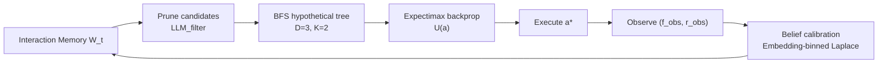

<!--
README 目标：清晰、可复现、易导航。
与论文 RISE: Reasoning with Interactions for LLM Agents in Multi-Agent Simulation 保持严格对齐。
-->

# RISE: Reasoning with Interactions for LLM Agents in Multi-Agent Simulation

RISE（**R**easoning with **I**nteractions in **S**imulation **E**nvironments）是一个免训练决策框架。它通过一棵有界深度的假设推理树，在确认行动前显式地前向推演候选行动如何在其他 Agent 的反应和环境演化中传播，分支概率由在线 Interaction Memory 提供，通过 embedding 分箱 Laplace 平滑从均匀先验出发在线校准，无需任何离线数据。

<p align="center">
    <a href="#quick-start">Quick Start</a> ·
    <a href="#diplomacy-tournament">Diplomacy</a> ·
    <a href="#delivery-rider-simulation">Delivery</a> ·
    <a href="#reproducibility">Reproducibility</a>
</p>

<p align="center">
    
    
    
</p>

---

## 目录

- [RISE: Reasoning with Interactions for LLM Agents in Multi-Agent Simulation](#rise-reasoning-with-interactions-for-llm-agents-in-multi-agent-simulation)
  - [目录](#目录)
  - [Quick Start](#quick-start)
  - [核心架构](#核心架构)
  - [实验场景](#实验场景)
    - [Diplomacy Tournament](#diplomacy-tournament)
    - [Delivery Rider Simulation](#delivery-rider-simulation)
  - [安装](#安装)
  - [LLM 配置](#llm-配置)
  - [Reproducibility](#reproducibility)
  - [项目结构](#项目结构)
  - [扩展指南](#扩展指南)

---

## Quick Start

```bash
python run_diplomacy.py
```

在 `run_diplomacy.py` 顶部设置 `RUN_MODE`（无需命令行参数）：

| `RUN_MODE`    | 说明                                    |
|---------------|----------------------------------------|
| `RQ3`         | 单模型配置，运行 50 局 Diplomacy tournament |
| `RQ3_MODELS`  | 四种 LLM backbone 各跑 50 局（论文 Table 1）|
| `RQ4`         | Full + 3 消融变体各跑 50 局（论文 Table 3） |

---

## 核心架构

RISE 将决策组织为四阶段闭环流水线：

1. **Interaction Memory 构建**：维护历史交互元组集合 $\mathcal{W}_t = \{(a_k, f_k, r_k, e_k)\}_{k=1}^{t-1}$，冷启动阶段对 $P_0(f,r\mid a)$ 使用均匀无信息先验。
2. **候选行动剪枝**：LLM filter 在元目标 $G_{\mathrm{meta}}$ 和 $\mathcal{W}_t$ 引导下将合法行动空间压缩为小候选集 $A_{\mathrm{cand}}$。
3. **假设推理树（BFS Expectimax）**：在搜索深度 $D$ 内前向展开，Top-$K$ 概率剪枝 + 目标条件风险过滤，所有同层节点合并为单次批量 LLM 调用以降低延迟；叶节点效用通过 Expectimax 回传至根节点，选取 $a^* = \arg\max_{a} U(a)$。
4. **动态信念校准**：执行 $a^*$ 后观测到 $(f_{\mathrm{obs}}, r_{\mathrm{obs}})$，通过 **embedding 分箱 hard argmax** 更新频率计数，再经 Laplace 平滑重校准 $P_{t+1}(f\mid a)$，对抗认知惰性。

**实验超参（Pareto 操作点，§4.3）**：搜索深度 $D=3$，Top-$K$ 分支 $K=2$，相似度阈值 $\tau=0.85$，采样温度 $T=0.5$。



---

## 实验场景

### Diplomacy Tournament

位置：`simulation/diplomacy/`，入口：`run_diplomacy.py`

基于经典桌游 No-Press Diplomacy。7 个国家 Agent 竞争有限 Supply Centers（SC）。标准协议为 20 轮（1901--1920），或一方占据 18 个 SC 时提前结束。

**Agent 组成（论文 §4.3，1:2:2:2）**

| Agent | 数量 | 核心机制 |
|---|---|---|
| **RISE** | 1 | BFS Expectimax + Online Interaction Memory |
| **ReAct** | 2 | Reason + Act，短上下文 |
| **LATS** | 2 | Language Agent Tree Search |
| **Hypothetical Minds** | 2 | Theory-of-Mind + 心智模拟 |

每局 RISE 按 `game_id % 7` 轮换国家席位，消除地缘偏差。

**评估指标（50 局平均）**

- **Win Rate**：游戏结束时持有最多 SC（并列计半胜）
- **Survival Rate**：游戏结束时至少保有 1 个 SC
- **Average SCs**：游戏结束时平均占有 SC 数

**论文主要结果（GPT-5，Table 1）**

| Method | Win (%) | Surv (%) | SCs |
|---|---|---|---|
| **RISE** | **66.0** | **94.0** | **5.40** |
| Hypothetical Minds | 14.0 | 26.0 | 0.62 |
| ReAct | 8.0 | 16.0 | 2.10 |
| LATS | 12.0 | 30.0 | 2.78 |

**输出文件**（保存到 `experiments/diplomacy_tournament_*/`）

| 文件 | 内容 |
|---|---|
| `RQ3_Performance.csv` | 胜率与对局结果（论文 RQ1） |
| `RQ2_Evolution.csv` | 逐轮 Interaction Memory 预测准确率（论文 RQ2） |
| `RQ4_Ablation.csv` | 消融汇总（论文 RQ3） |
| `Turn_Log.csv` | 逐回合详细日志 |
| `console_output.log` | 完整控制台输出 |

**消融变体（RUN_MODE=RQ4，论文 Table 3）**

| 变体 | 说明 |
|---|---|
| `Full_Model` | 全模块启用 |
| `w/o_Interaction_Memory` | 退化为均匀先验 $P_0$ |
| `w/o_Hypothetical_Reasoning` | 跳过 BFS 树，退化为单次 LLM 调用 |
| `w/o_Utility_Risk` | 同时禁用叶节点效用打分与风险过滤 |

---

### Delivery Rider Simulation

位置：`simulation/SocialInvolution/`

模拟外卖平台上的骑手工时决策与订单派发策略。50 个骑手 Agent 在 $200\times200$ 网格上并发运行 30 天（3600 步，120 步/天）；订单通过时空 Poisson 过程生成（基础率 $\lambda_{\mathrm{base}}=2$，峰值 $\lambda_{\mathrm{peak}}=15$）。

**评估指标（10 次独立运行平均）**

- **Avg Daily Profit**：平均每日收益
- **P/D (Profit per Distance)**：单位距离收益，衡量竞争下的配送效率
- **Fulfillment Rate**：订单完成率

**论文主要结果（GPT-5，Table 2）**

| Method | Profit | P/D | Ful (%) |
|---|---|---|---|
| **RISE** | **313.8** | **64.9** | **97.6** |
| LATS | 282.1 | 55.7 | 90.6 |
| ReAct | 263.2 | 50.6 | 85.4 |
| Hypothetical Minds | 246.0 | 47.0 | 81.2 |
| Greedy Heuristic | 218.7 | 38.0 | 71.8 |

**支持的决策框架**（通过 `SociologyAgent` 适配）

| Framework | Mixin Class |
|---|---|
| **RISE（核心方法）** | `RiderLLMAgent` |
| **ReAct** | `RiderReActAgent` |
| **LATS** | `RiderLATSAgent` |
| **Hypothetical Minds** | `RiderHypotheticalMinds` |
| **Greedy Heuristic** | `RiderGreedyHeuristic` |

---

## 安装

**环境要求**：Python 3.10+

```bash
# 创建虚拟环境
python -m venv .venv

# 激活（Windows PowerShell）
.venv\Scripts\Activate.ps1

# 安装依赖
pip install -r requirements.txt
```

---

## LLM 配置

通过环境变量配置 LLM 后端。论文使用四种 backbone：GPT-5、Qwen3-235B、Gemma-3-27B、GPT-OSS-20B，嵌入模型统一使用 Qwen text-embedding-v3。

### DashScope（Qwen，OpenAI compatible）

```powershell
setx DASHSCOPE_API_KEY "your_key"
setx DASHSCOPE_BASE_URL "https://dashscope.aliyuncs.com/compatible-mode/v1"
```

### OpenAI Compatible Endpoints（本地/代理）

```powershell
setx OPENAI_API_KEY "your_key"
setx OPENAI_BASE_URL "http://localhost:8500/v1"
```

> `setx` 写入用户环境变量后需重启终端/VS Code 生效；临时生效可用 `$env:OPENAI_API_KEY="..."`。

---

## Reproducibility

- 所有实验遵循**零样本冷启动**协议：无离线自博弈、无人类记录、无少样本示例（ReAct 除外，含 2 条格式示例）。
- 实验输出写入 `experiments/`（按时间戳创建独立目录），便于复现与横向对比。
- 发布结果时建议记录：代码 commit hash、`requirements.txt`、所用模型/后端与关键环境变量。
- **Prompts**：RISE Agent 与所有 baseline agent 使用的完整 LLM 提示词见 [`PROMPTS.md`](PROMPTS.md)，对应论文 §4.3 承诺公开的内容。

---

## 项目结构

```
project_root/
├── run_diplomacy.py                  # Diplomacy tournament 入口（RQ1/RQ2/RQ3）
├── PROMPTS.md                        # 全部 LLM 提示词（论文 §4.3）
├── requirements.txt
│
├── agents/
│   ├── rise_agent.py                 # RISE Agent（4 阶段决策流水线）
│   ├── diplomacy_baselines.py        # ReAct / LATS / Hypothetical Minds baselines
│   ├── hypothetical_minds_agent.py
│   ├── ReActAgent.py
│   └── LATSAgent.py
│
├── simulation/
│   ├── diplomacy/
│   │   └── tournament.py             # Tournament runner（1:2:2:2 组成 + 席位轮换）
│   ├── SocialInvolution/             # Delivery 场景（50 骑手，200×200，3600 步）
│   │   ├── algorithm/
│   │   ├── config/
│   │   └── entity/
│   └── models/
│       ├── agents/
│       │   ├── LLMAgent.py           # LLM 封装（OpenAI/DashScope/Ollama）
│       │   ├── GameAgent.py
│       │   └── SociologyAgent.py
│       └── cognitive/
│
├── visualize/                        # 可视化脚本
│
└── experiments/                      # 自动生成的实验输出（gitignore）
```

---

## 扩展指南

| 目标 | 方法 |
|---|---|
| 新增 Diplomacy Baseline | 继承 `_LLMBaselineBase`（`agents/diplomacy_baselines.py`），在 `tournament.py` 的 `BASELINE_TYPES` 中注册 |
| 新增 Delivery Baseline | 在 `simulation/models/agents/SociologyAgent.py` 中实现 Rider Mixin |
| 新增评估指标 | 扩展 `simulation/models/cognitive/evaluation_system.py` |
| 新增模拟场景 | 在 `simulation/` 下创建新目录，实现 `ScenarioAdapter` |
| 自定义可视化 | 在 `visualize/` 中添加脚本 |
